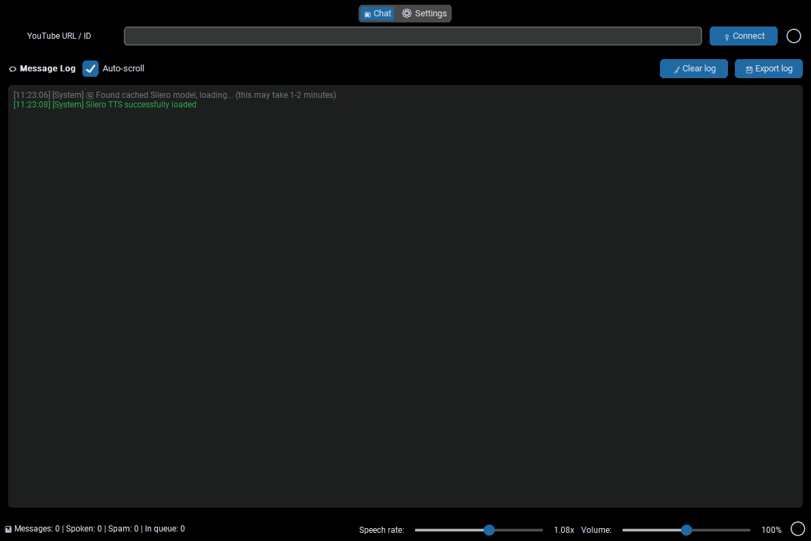

# FJ Chat Voice - Text to Speech

This is a program for real-time chat voiceover using the Silero model.

It uses the Google API to retrieve messages from YouTube chat and converts them to speech. The key acquisition method is described in the instructions.
The first launch may take 1-2 minutes, as the program downloads the model and caches it for subsequent launches.

- The program is completely free.
- The program interface is Russian and English, and it also supports voiceover in Russian and English.
- Currently, the program only supports YouTube, but I plan to add support for Twitch and other platforms in the future.

Implemented features:

- Voice selection
- Spam filter and stop words list
- Adjustable voiceover volume
- Adjustable voiceover speed
- Adjustable number of messages in the queue
- Speak numbers in messages
- Translation of chat messages into speech language

Limitations:

- The Google API has a limit on the number of requests per day, typically quota equal 10,000. View your quota: [Google Console: Quotas](https://console.cloud.google.com/iam-admin/quotas)



## Text-to-speech for YouTube streams

### Google API Key

#### 1. Create new project

Go to Google Console: https://console.cloud.google.com/


#### 2. Enable YouTube Data API v3

https://console.cloud.google.com/apis/api/youtube.googleapis.com/

#### 3. Create API Key

Google Console > APIs & Services > Credentials > Create credentials > API key


## Launch from source code

```
git clone https://github.com/facejungle/fj_chat_voice.git
cd fj_chat_voice

pip install -r torch.requirements.txt
pip install -r requirements.txt

python main.py
```

## Build

```
python build.py
```

## Thanks for [Silero](https://github.com/snakers4/silero-models/) :)
